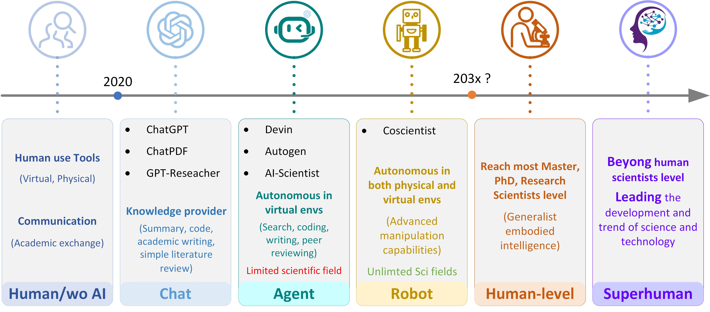

# Awesome AI Scientist Papers   

Welcome to the **Awesome AI Scientist Papers** repository! This project aims to curate a collection of important papers to the field of AI/Robot Scientist. PLease cite it if help [cite](#cite)

  
   
  <em>This timeline illustrates key milestones and future predictions in the development of autonomous AI/Robot scientists.</em>

## Table of Contents

- [Papers](#papers)
- [Survey](#survey)
- [cite](#cite)

## Papers

- [The AI Scientist: Towards Fully Automated Open-Ended Scientific Discovery](https://www.arxiv.org/abs/2408.06292), Chris Lu et al., Arxiv, 2024

- [Autonomous Generalist Scientist: Towards and Beyond Human-level Automatic Research Using Foundation Model-Based AI Agents and Robots (A Position)](http://dx.doi.org/10.13140/RG.2.2.35148.01923), Starkson Zhang et al., ResearchGate, 2024 

- [Researchers built an ‘AI Scientist’ — what can it do?](https://doi.org/10.1038/d41586-024-02842-3), Davide Castelvecchi et al., Nature, 2024 

- [ChatGPT as Research Scientist: Probing GPT’s capabilities as a Research Librarian, Research Ethicist, Data Generator, and Data Predictor](https://doi.org/10.1073/pnas.2404328121), Steven A. Lehr et al., PNAS, 2024 

Autonomous Literature Review

Todo.

Proposal, Idea Generation

- [Can LLMs Generate Novel Research Ideas? A Large-Scale Human Study with 100+ NLP Researchers](https://arxiv.org/abs/2409.04109), Chenglei Si et al., Arxiv, 2024

- [ResearchAgent: Iterative Research Idea Generation over Scientific Literature with Large Language Models](https://doi.org/10.48550/arXiv.2404.07738), Jinheon Baek et al., Arxiv, 2024

Virtual, Digital, Agent, Experimentation

- [The AI Scientist: Towards Fully Automated Open-Ended Scientific Discovery](https://www.arxiv.org/abs/2408.06292), Chris Lu et al., Arxiv, 2024

- [SciAgents: Automating scientific discovery through multi-agent intelligent graph reasoning](https://www.arxiv.org/abs/2409.05556), Alireza Ghafarollahi et al., Arxiv, 2024

- [Empowering Biomedical Discovery with AI Agents](https://arxiv.org/abs/2404.02831), Shanghua Gao et al., Arxiv, 2024

- [Intelligent software for laboratory automation](https://doi.org/10.1016/j.tibtech.2004.07.010), Ken E. Whelan et al., Trends in Biotechnology, 2004

Physical, Robot, Experimentation

- [A multi-agent-driven robotic AI chemist enabling autonomous chemical research on demand](https://doi.org/10.26434/chemrxiv-2024-w953h-v2), Tao Song et al., Chemrxiv, 2024

- [Autonomous chemical research with large language models](https://www.nature.com/articles/s41586-023-06792-0), Daniil A. Boiko et al., Nature, 2023

- [An ontology for a Robot Scientist](https://doi.org/10.1093/bioinformatics/btl207), Larisa N. Soldatova et al., Bioinformatics, 2006

Manuscript

Todo.

Peer Review

- [Automated scholarly paper review: Concepts, technologies, and challenges](https://doi.org/10.1016/j.inffus.2023.101830), Jialiang Lin et al., Information Fusion, 2023

- [Automated Peer Reviewing in Paper SEA: Standardization, Evaluation, and Analysis](https://doi.org/10.48550/arXiv.2407.12857), Jianxiang Yu et al., Arxiv, 2024

## Survey
- [Towards robot scientists for autonomous scientific discovery](https://doi.org/10.1186%2F1759-4499-2-1), Andrew Sparkes et al., Automated experimentation, 2010

## Cite
@article{zhangautonomous,
  title={Autonomous Generalist Scientist: Towards and Beyond Human-level Automatic Research Using Foundation Model-Based AI Agents and Robots (A Position)},
  author={Zhang, Starkson and Pearson, Alfredo and Wang, Zhenting}
}

## License
MIT
